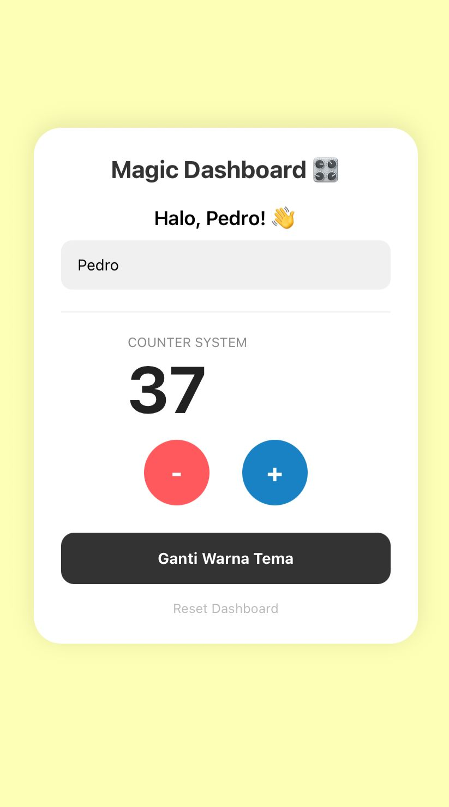

# Project M4: Interaction Master ⚡
Tugas praktikum Minggu 4 - State & Events oleh Pedro Pasaribu.

## 📸 Preview

## 🛠️ Logic Implemented
- **useState Hook:** Mengelola state untuk input nama, angka counter, dan perubahan warna background.
- **Event Handlers:** Implementasi `onChangeText` untuk binding nama secara real-time dan `onPress` untuk fungsi counter serta ganti warna.
- **Validation Logic:** Menambahkan validasi agar angka counter tidak bisa kurang dari 0 (tidak minus).
- **Reset Logic:** Menghapus input nama, mereset angka ke 0, dan mengembalikan warna tema dalam satu tap.

## 🔗 Demo
[Cek di Expo Snack](https://snack.expo.dev/@pedroo.pasaribu/privileged-yellow-sandwich)